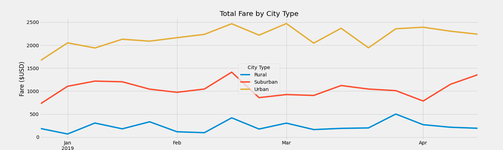

# PyBer_Analysis
  Management at Pyber needs to assess the company based on analytics with charts that identify performance based on city type. By grouping the data by city type and trending it over a time period I was able to convert the summarized data into story telling visuals, see images below. As per image 1 below the summary dataframe depicts the performance of each city type per capita in which rural ranks number 1 highest average fare and urban has the lowest average fare; whereas, Urban has the highest total revenue (Fares). This tells us that the demand and supply is what drives the average fare price. 
## Image 1:

In the multiple line-graph (see image 2 below), around mid February you see that all three city types take a peak. Aside from that the revenue trend is volatile. 
## Image 2:

One of the challenges I faced during the analysis was “binning” the dataset into different time buckets. The original index of date was an object type and not a datetime index. Using the type() method I identified the object and using the pd.to_datetime() method I was able to convert the date column into a datetime field. And then use the date column as an index.

As we reviewed each city type’s revenue above, it would be helpful to see additional information with additional dataset. Seeing each city’s information and how many residents live in each city would help determine the percentage of the population that is utilizing Pyber’s services. To improve the use of Pyber’s services marketing can be enhanced based off demographics of passengers. The additional demographics dataset can provide location, age, average household income, etc. to build marketing materials and forecast revenue. 
